# Домашнее задание к занятию 4 «Оркестрация группой Docker контейнеров на примере Docker Compose»

## Задача 1
https://hub.docker.com/r/rrchip/custom-nginx

## Задача 2
1.
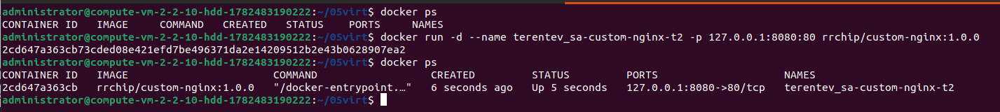

2.
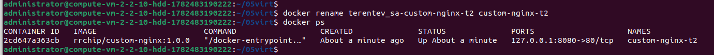

3.
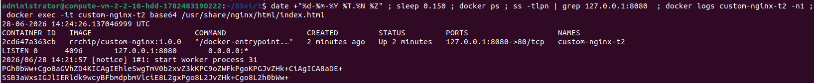

4.
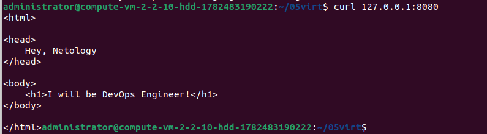

Общее.

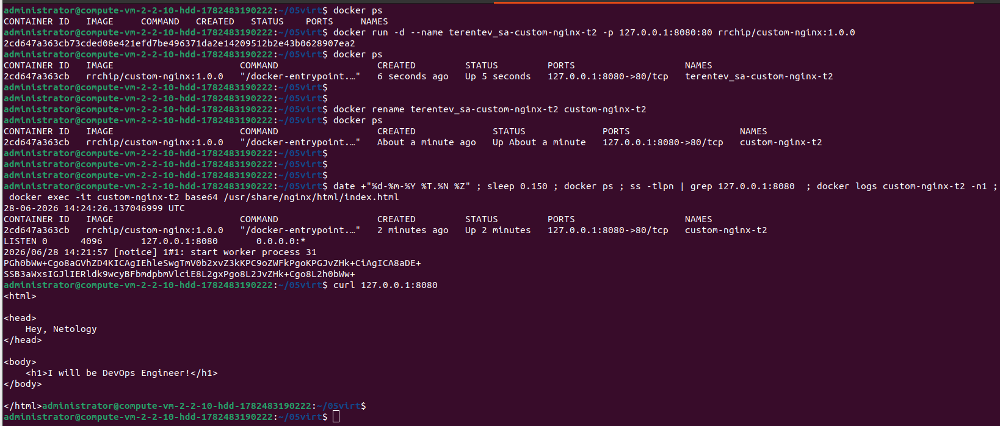

## Задача 3

1-3
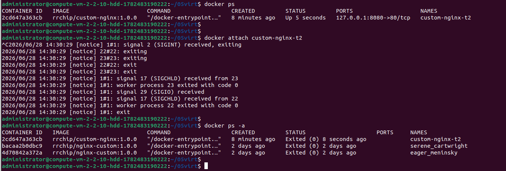

docker attach подключается к основному процессу контейнера с PID 1.\
Ctrl+c посылает SIGKILL главному процессу приаттаченного контейнера

4-6
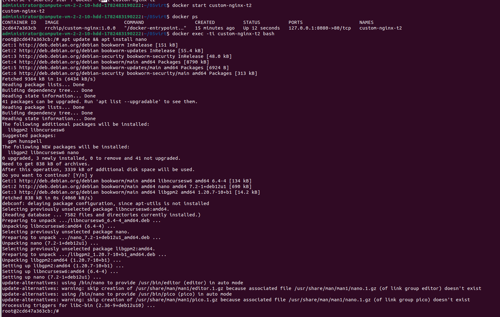

7-9\
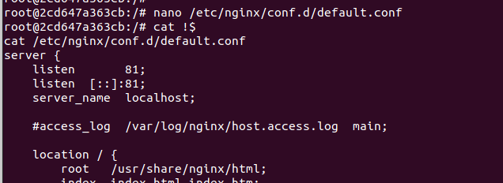
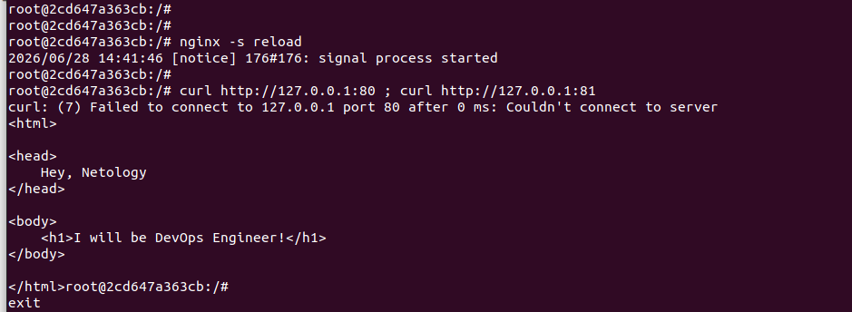

10
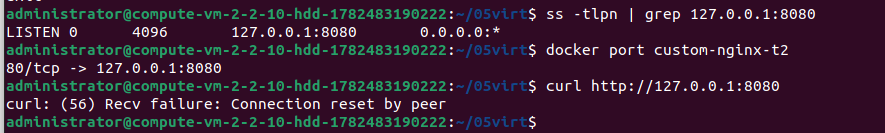
Изменен внутренний порт веб-сервера Nginx с 80 на 81 напрямую в конфигурационных файлах «на лету». \
Однако подсистема Docker ничего об этом изменении не знает. При запуске контейнера Docker жестко зафиксировано правило перенаправления: трафик с порта 8080 хоста должен уходить на порт 80 внутри контейнера.\
Сейчас запросы с хоста (через порт 8080) продолжают стучаться на порт 80 контейнера, но там их больше никто не ждет, так как Nginx теперь слушает порт 81.

11
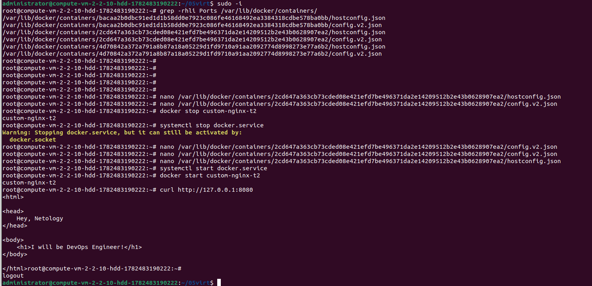

12
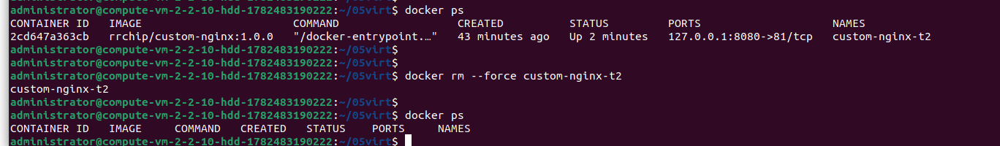

## Задача 4

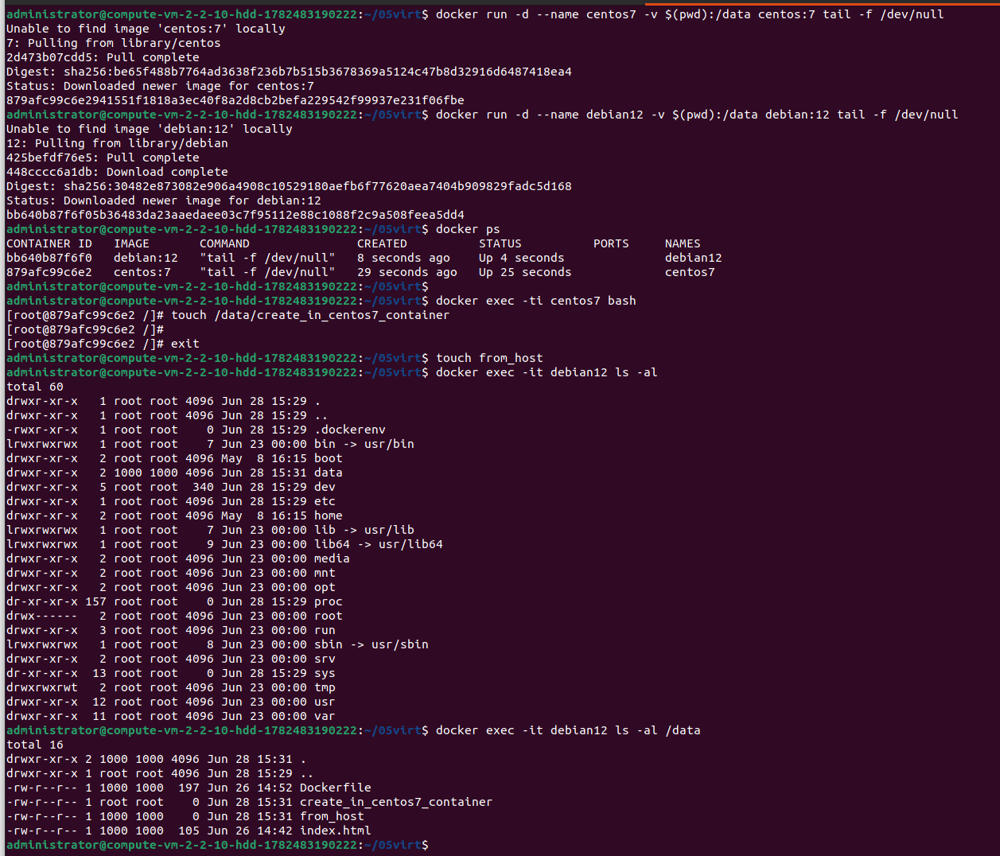