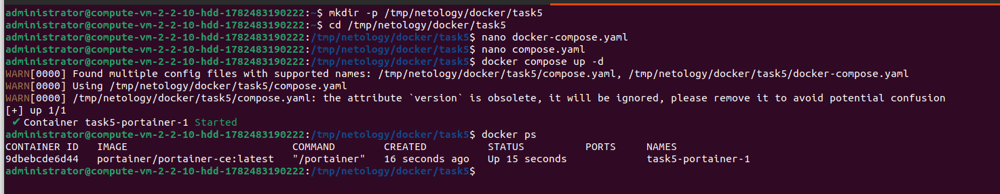
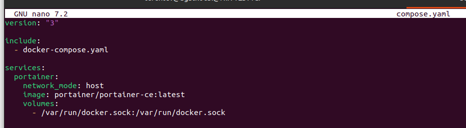
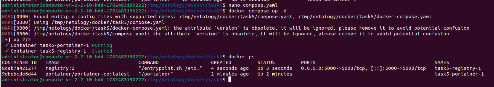
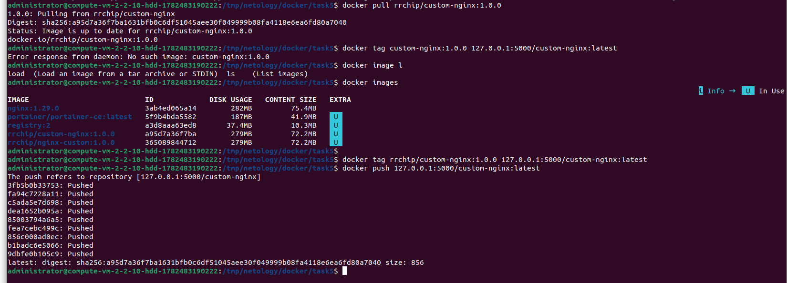
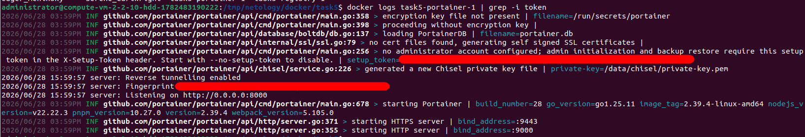
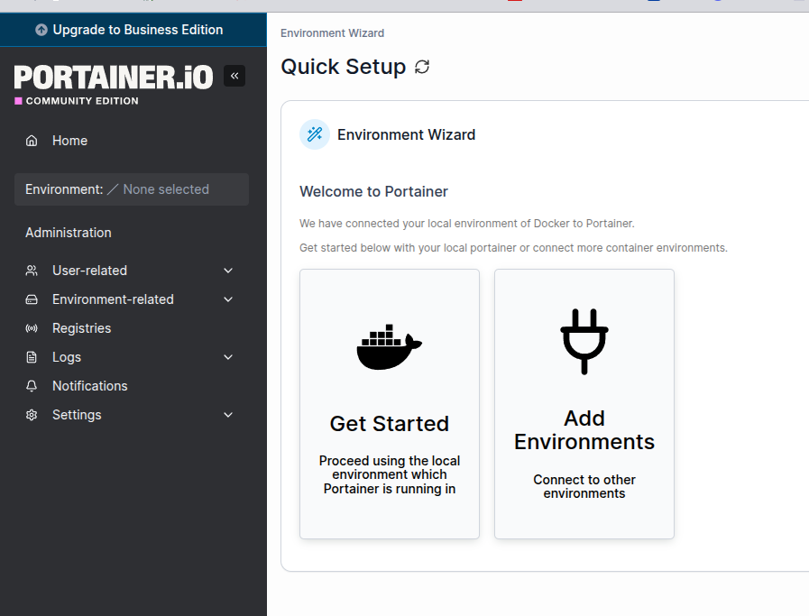
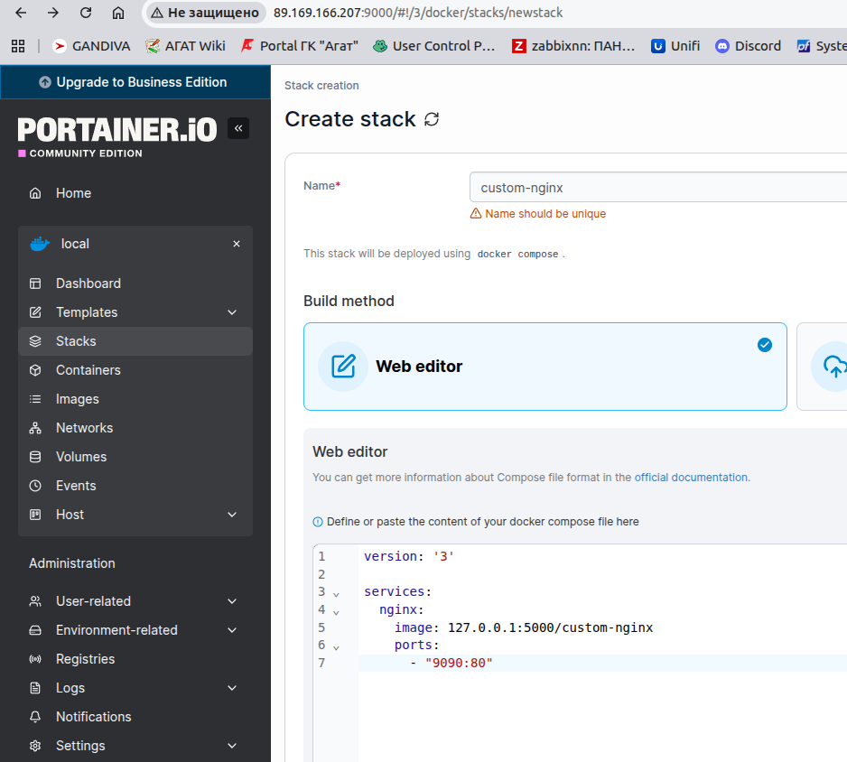
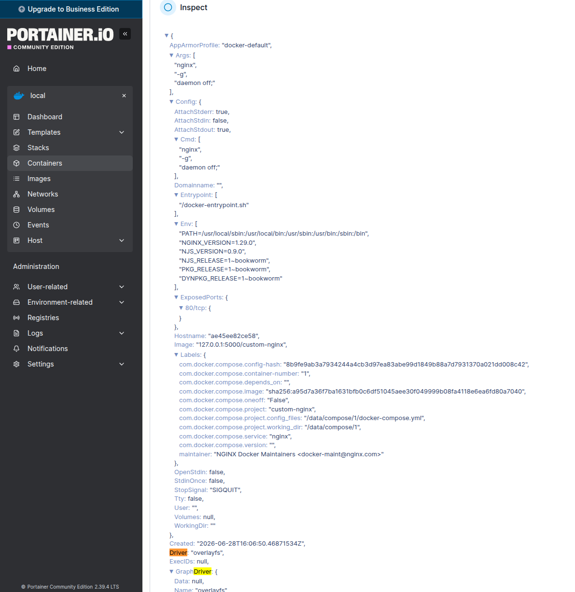
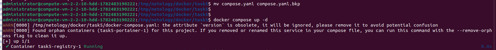
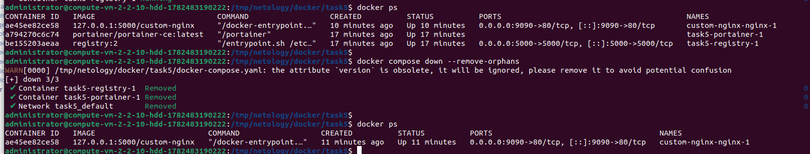

# Домашнее задание к занятию 4 «Оркестрация группой Docker контейнеров на примере Docker Compose»

## Задача 1
https://hub.docker.com/r/rrchip/custom-nginx

## Задача 2
1.

2.

3.

4.

Общее.

## Задача 3

1-3

docker attach подключается к основному процессу контейнера с PID 1.\
Ctrl+c посылает SIGKILL главному процессу приаттаченного контейнера

4-6

7-9\

10

Изменен внутренний порт веб-сервера Nginx с 80 на 81 напрямую в конфигурационных файлах «на лету». \
Однако подсистема Docker ничего об этом изменении не знает. При запуске контейнера Docker жестко зафиксировано правило перенаправления: трафик с порта 8080 хоста должен уходить на порт 80 внутри контейнера.\
Сейчас запросы с хоста (через порт 8080) продолжают стучаться на порт 80 контейнера, но там их больше никто не ждет, так как Nginx теперь слушает порт 81.

11

12

## Задача 4

## Задача 5

1

Запустился файл compose.yaml так как он предпочтительный. docker-compose.yamlи docker-compose.yml так же поддерживаются для обратной совместимости с более ранними версиями. Если оба файла существуют, Compose предпочитает файл compose.yaml.

2

3

4

5

6

7

Docker Compose обнаружил, что в данной рабочей директории (в рамках текущего проекта) ранее был запущен контейнер portainer. Однако в текущем конфигурационном файле (docker-compose.yaml, который теперь стал активным) описание этого сервиса отсутствует. Такие контейнеры Compose считает "осиротевшими".
